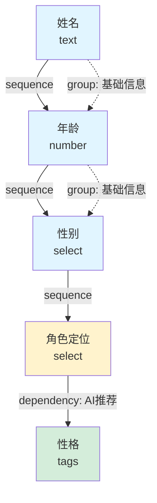
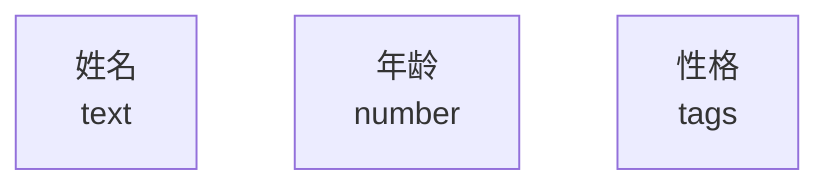
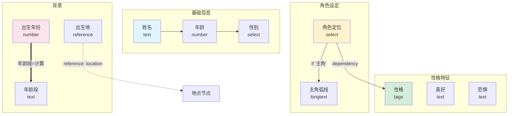
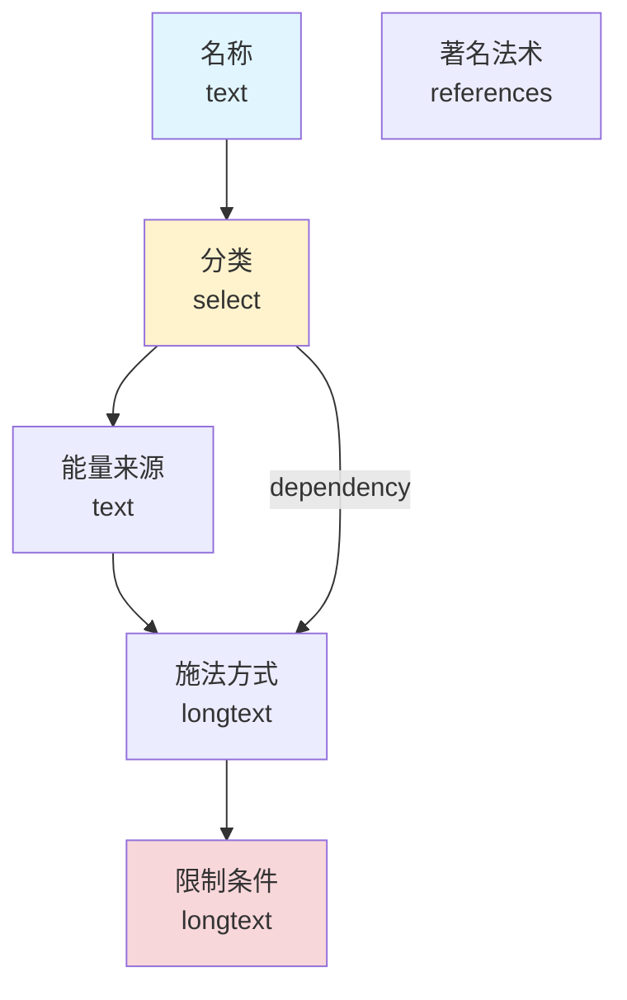
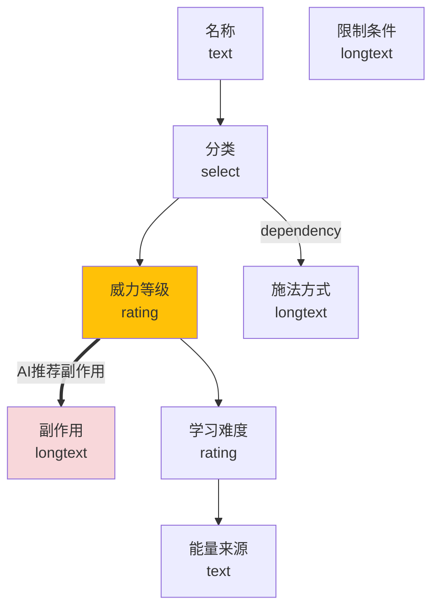
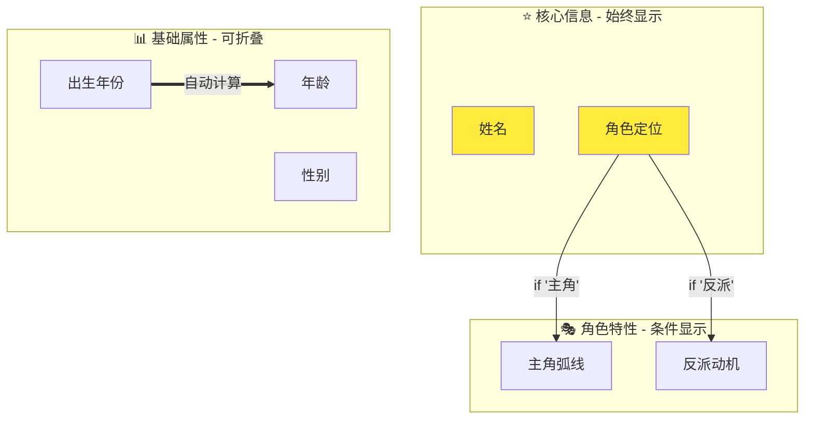
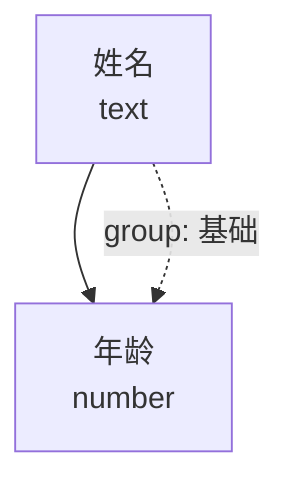
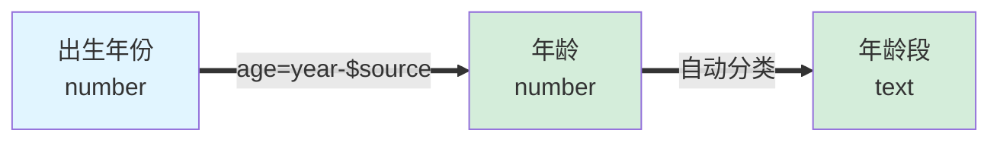

# 基于图结构的字段关系系统

## 1. 问题重审：JSON Schema 编辑对用户不友好

### 1.1 当前方案的局限

在前面的设计中，我们主要采用了"模板 + 字段列表"的方式：
- 用户通过配置 JSON Schema 定义字段
- 字段之间的关系通过 `group` 等属性隐式表达
- 依赖关系（如"年龄"→"年龄段"）需要代码实现

**问题**：
- 对于非技术用户，JSON Schema 仍然是技术概念
- 字段间的逻辑关系（依赖、派生、引用）不直观
- 难以可视化地理解和修改模板结构

### 1.2 图结构（Node-Edge）的优势

**核心思想**：将字段视为节点（Node），字段间的关系视为边（Edge）。

**优势**：
1. **可视化**：用户能直观看到字段间的关系网络
2. **交互友好**：拖拽节点、连线即可建立关系，无需编写配置
3. **关系明确**：依赖、派生、引用等关系通过边类型清晰表达
4. **易于理解**：非技术用户也能理解"A 指向 B"的含义

---

## 2. 图结构设计：字段关系图谱

### 2.1 核心概念

#### 节点（Field Node）

每个字段是一个节点：

```typescript
type FieldNode = {
  id: string                    // 唯一标识，如 'personality'
  type: 'field'
  label: string                 // 显示标签，如 '性格'
  valueType: FieldValueType     // 字段值类型
  uiConfig?: FieldUIConfig      // UI 配置
  
  // 节点位置（用于可视化编辑器）
  position?: { x: number; y: number }
  
  // 元数据
  metadata?: {
    description?: string        // 字段说明
    example?: string            // 示例值
    aiPrompt?: string           // AI 填充提示
  }
}
```

#### 边（Relationship Edge）

字段间的关系是边：

```typescript
type RelationshipEdge = {
  id: string
  type: EdgeType
  source: string                // 源字段 ID
  target: string                // 目标字段 ID
  
  // 边配置
  config?: EdgeConfig
  
  // 元数据
  metadata?: {
    label?: string              // 关系标签
    description?: string        // 关系说明
  }
}

type EdgeType = 
  | 'dependency'                // 依赖：source 变化时，target 需要更新
  | 'derivation'                // 派生：target 由 source 计算得出
  | 'reference'                 // 引用：target 引用 source 的值
  | 'group'                     // 分组：source 和 target 属于同一组
  | 'sequence'                  // 顺序：source 在 target 之前显示
  | 'condition'                 // 条件：source 满足条件时，target 才显示
```

#### 图（Template Graph）

模板本身是一个图：

```typescript
type TemplateGraph = {
  id: string
  label: string
  nodes: FieldNode[]            // 字段节点列表
  edges: RelationshipEdge[]     // 关系边列表
  
  // 图元数据
  metadata?: {
    description?: string
    version?: string
    author?: string
  }
}
```

### 2.2 关系类型详解

#### 2.2.1 依赖关系（Dependency）

**语义**：当源字段变化时，目标字段需要重新验证或更新。

**示例**：
- `出生年份` → `年龄`：出生年份变化时，年龄需要重新计算
- `角色定位` → `相关字段`：角色定位变化时，某些字段的可见性可能改变

**边配置**：
```typescript
type DependencyConfig = {
  trigger: 'change' | 'blur' | 'manual'  // 触发时机
  action: 'revalidate' | 'recalculate' | 'notify'  // 执行动作
}
```

**可视化**：
```
┌──────────────┐
│  出生年份     │
└──────────────┘
        │ dependency
        ↓
┌──────────────┐
│  年龄        │
└──────────────┘
```

#### 2.2.2 派生关系（Derivation）

**语义**：目标字段的值由源字段计算得出（公式字段）。

**示例**：
- `出生年份` → `年龄`：年龄 = 当前年份 - 出生年份
- `身高(cm)` → `身高(ft)`：身高(ft) = 身高(cm) / 30.48

**边配置**：
```typescript
type DerivationConfig = {
  formula: string               // 计算公式（JavaScript 表达式）
  autoUpdate: boolean           // 是否自动更新
}
```

**示例配置**：
```typescript
{
  type: 'derivation',
  source: 'birthYear',
  target: 'age',
  config: {
    formula: 'new Date().getFullYear() - $source',
    autoUpdate: true
  }
}
```

**可视化**：
```
┌──────────────┐
│  出生年份     │
│  1990        │
└──────────────┘
        │ derivation
        │ age = year - $source
        ↓
┌──────────────┐
│  年龄        │
│  35 (自动)   │
└──────────────┘
```

#### 2.2.3 引用关系（Reference）

**语义**：目标字段引用源字段的值或节点。

**示例**：
- `出生地` → `world.geo.location` 节点
- `所属势力` → `world.society.faction` 节点
- `关系人物` → 其他角色节点

**边配置**：
```typescript
type ReferenceConfig = {
  nodeTypeFilter?: string[]     // 允许引用的节点类型
  allowMultiple?: boolean       // 是否允许多个引用
  bidirectional?: boolean       // 是否双向引用
}
```

**可视化**：
```
┌──────────────┐
│  角色: 艾莉亚 │
│  出生地 ──────┼───→ ┌──────────────┐
└──────────────┘      │ 地点: 北方村庄│
                      └──────────────┘
```

#### 2.2.4 分组关系（Group）

**语义**：多个字段属于同一逻辑分组。

**示例**：
- `身高`、`体型`、`发型`、`眼睛` → `外观组`
- `性格特质`、`喜好`、`恐惧` → `性格组`

**边配置**：
```typescript
type GroupConfig = {
  groupId: string               // 分组 ID
  collapsible?: boolean         // 是否可折叠
  defaultCollapsed?: boolean    // 默认是否折叠
}
```

**可视化**：
```
        ┌──────────────┐
        │  外观 (分组)  │
        └──────────────┘
         ↙     ↓     ↘
┌────────┐ ┌────────┐ ┌────────┐
│ 身高   │ │ 发型   │ │ 眼睛   │
└────────┘ └────────┘ └────────┘
```

#### 2.2.5 顺序关系（Sequence）

**语义**：源字段应该在目标字段之前显示。

**示例**：
- `姓名` → `年龄` → `性别`：基础信息的显示顺序

**可视化**：
```
┌────────┐  sequence  ┌────────┐  sequence  ┌────────┐
│ 姓名   │ ─────────→ │ 年龄   │ ─────────→ │ 性别   │
└────────┘            └────────┘            └────────┘
```

#### 2.2.6 条件关系（Condition）

**语义**：源字段满足条件时，目标字段才显示。

**示例**：
- `角色定位` = '主角' → 显示 `主角弧线` 字段
- `使用魔法` = true → 显示 `魔法类型` 字段

**边配置**：
```typescript
type ConditionConfig = {
  condition: string             // 条件表达式
  action: 'show' | 'hide' | 'enable' | 'disable'  // 满足条件时的动作
}
```

**示例配置**：
```typescript
{
  type: 'condition',
  source: 'role',
  target: 'protagonistArc',
  config: {
    condition: '$source === "主角"',
    action: 'show'
  }
}
```

**可视化**：
```
┌──────────────┐
│ 角色定位      │
│ [主角 ▼]     │
└──────────────┘
        │ condition
        │ if $source === '主角'
        ↓
┌──────────────┐
│ 主角弧线      │ ← 仅当角色定位为主角时显示
└──────────────┘
```

---

## 3. 可视化编辑器设计

### 3.1 画布（Canvas）

类似 n8n 或 Figma 的画布：
- 无限画布，支持平移和缩放
- 节点以卡片形式显示
- 边以连线显示，带箭头和标签

### 3.2 节点卡片

```
┌─────────────────────────┐
│ 🔵 性格                  │
├─────────────────────────┤
│ 类型: tags              │
│ 分组: personality       │
├─────────────────────────┤
│ • 依赖: 角色定位        │
│ • 引用: -               │
└─────────────────────────┘
  ↑ 拖拽手柄
```

### 3.3 创建关系

**流程**：
1. 点击源节点的输出锚点（右侧）
2. 拖拽到目标节点的输入锚点（左侧）
3. 弹出关系类型选择器
4. 选择关系类型并配置

**关系类型选择器**：
```
┌─────────────────────────────┐
│ 选择关系类型                 │
├─────────────────────────────┤
│ ◯ 依赖 (Dependency)         │
│ ◯ 派生 (Derivation)         │
│ ◯ 引用 (Reference)          │
│ ◯ 分组 (Group)              │
│ ◯ 顺序 (Sequence)           │
│ ◯ 条件 (Condition)          │
├─────────────────────────────┤
│ [取消]  [确定]              │
└─────────────────────────────┐
```

### 3.4 侧边栏

**左侧**：字段库（可拖拽到画布）
```
┌──────────────────┐
│ 字段库           │
├──────────────────┤
│ 基础字段         │
│ • 文本           │
│ • 数字           │
│ • 选择           │
│ • 标签           │
│                  │
│ 引用字段         │
│ • 节点引用       │
│ • 多节点引用     │
│                  │
│ 高级字段         │
│ • 富文本         │
│ • 日期时间       │
│ • 计算字段       │
└──────────────────┘
```

**右侧**：属性面板（选中节点或边时显示）
```
┌──────────────────────────┐
│ 属性                     │
├──────────────────────────┤
│ 字段 ID: personality     │
│ 显示标签: 性格            │
│ 字段类型: tags           │
│                          │
│ UI 配置                  │
│ • 提示词: [...]         │
│ • 占位符: [...]         │
│                          │
│ 验证规则                 │
│ ☑ 必填                  │
│ ☐ 唯一                  │
│                          │
│ [保存]  [删除字段]       │
└──────────────────────────┘
```

### 3.5 工具栏

```
┌────────────────────────────────────────────────┐
│ [👆 选择] [🖐️ 平移] [🔍 缩放] [➕ 添加字段]   │
│ [🧹 清理布局] [💾 保存] [👁️ 预览]             │
└────────────────────────────────────────────────┘
```

---

## 4. 用户交互流程

### 4.1 创建新模板

**场景**：用户要创建一个"魔法体系"模板。

**流程**：
1. 点击"新建模板"
2. 输入模板名称："魔法体系"
3. 进入画布编辑器

**AI 辅助**：
- AI 推荐常用字段（名称、分类、能量来源、施法方式、限制条件）
- 用户点击"采纳推荐"，字段自动添加到画布
- AI 自动建立基础关系（如分组、顺序）

### 4.2 添加字段

**方式 1：从字段库拖拽**
1. 从左侧字段库拖拽"标签"字段到画布
2. 双击节点，编辑标签和配置
3. 保存

**方式 2：AI 生成**
1. 在画布空白处右键
2. 选择"AI 推荐字段"
3. 输入需求："我需要一个字段来描述魔法的副作用"
4. AI 生成字段定义，用户确认后添加

### 4.3 建立关系

**场景**：用户希望"魔法等级"字段根据"施法次数"自动计算。

**流程**：
1. 点击"施法次数"节点的输出锚点
2. 拖拽连线到"魔法等级"节点的输入锚点
3. 选择关系类型："派生 (Derivation)"
4. 输入公式：`Math.floor($source / 10)`
5. 保存

**可视化效果**：
```
┌──────────────┐
│ 施法次数      │
│ 125          │
└──────────────┘
        │ derivation
        │ Math.floor($source / 10)
        ↓
┌──────────────┐
│ 魔法等级      │
│ 12 (自动)    │
└──────────────┘
```

### 4.4 条件显示

**场景**：只有当"角色定位"为"施法者"时，才显示"魔法体系"字段。

**流程**：
1. 连线："角色定位" → "魔法体系"
2. 选择关系类型："条件 (Condition)"
3. 输入条件：`$source === "施法者"`
4. 选择动作："显示"
5. 保存

**运行时效果**：
- 用户选择"角色定位"为"施法者"时，"魔法体系"字段自动出现
- 选择其他值时，"魔法体系"字段隐藏

---

## 5. 数据存储与运行时

### 5.1 存储格式

图结构以 JSON 格式存储：

```json
{
  "id": "char.card.v2",
  "label": "角色卡（图结构版）",
  "nodes": [
    {
      "id": "name",
      "type": "field",
      "label": "姓名",
      "valueType": "text",
      "position": { "x": 100, "y": 100 },
      "metadata": {
        "description": "角色的全名",
        "aiPrompt": "根据世界观背景生成一个合适的名字"
      }
    },
    {
      "id": "age",
      "type": "field",
      "label": "年龄",
      "valueType": "number",
      "position": { "x": 100, "y": 200 },
      "uiConfig": { "min": 0, "max": 200 }
    },
    {
      "id": "personality",
      "type": "field",
      "label": "性格",
      "valueType": "tags",
      "position": { "x": 300, "y": 200 },
      "metadata": {
        "aiPrompt": "用 3-5 个关键词描述性格特质"
      }
    }
  ],
  "edges": [
    {
      "id": "edge1",
      "type": "sequence",
      "source": "name",
      "target": "age",
      "metadata": { "label": "显示顺序" }
    },
    {
      "id": "edge2",
      "type": "group",
      "source": "personality",
      "target": "likes",
      "config": {
        "groupId": "personality_group",
        "collapsible": true
      }
    }
  ]
}
```

### 5.2 运行时渲染

**渲染器逻辑**：
1. 加载图结构
2. 根据边关系构建渲染树：
   - 解析 `sequence` 边，确定字段顺序
   - 解析 `group` 边，构建分组
   - 解析 `condition` 边，计算字段可见性
3. 渲染 UI

**依赖处理**：
1. 监听字段值变化
2. 查找从该字段出发的 `dependency` 和 `derivation` 边
3. 触发目标字段的更新或重新计算

**示例代码**：
```typescript
class GraphTemplateRenderer {
  private graph: TemplateGraph
  private fieldValues: Record<string, any>
  
  render() {
    // 1. 根据 sequence 边排序
    const orderedNodes = this.topologicalSort('sequence')
    
    // 2. 根据 group 边分组
    const groups = this.buildGroups()
    
    // 3. 渲染
    for (const node of orderedNodes) {
      if (this.isVisible(node)) {
        this.renderField(node)
      }
    }
  }
  
  isVisible(node: FieldNode): boolean {
    // 查找指向该节点的 condition 边
    const conditionEdges = this.graph.edges.filter(
      e => e.type === 'condition' && e.target === node.id
    )
    
    // 检查所有条件是否满足
    return conditionEdges.every(edge => {
      const sourceValue = this.fieldValues[edge.source]
      return this.evaluateCondition(edge.config.condition, sourceValue)
    })
  }
  
  onFieldChange(fieldId: string, newValue: any) {
    this.fieldValues[fieldId] = newValue
    
    // 查找从该字段出发的边
    const outgoingEdges = this.graph.edges.filter(e => e.source === fieldId)
    
    for (const edge of outgoingEdges) {
      if (edge.type === 'derivation') {
        // 重新计算派生字段
        const derivedValue = this.evaluateFormula(edge.config.formula, newValue)
        this.fieldValues[edge.target] = derivedValue
      } else if (edge.type === 'condition') {
        // 重新计算目标字段可见性
        this.updateVisibility(edge.target)
      }
    }
  }
}
```

---

## 6. 与现有设计的融合

### 6.1 混合模式

**建议**：图结构不是替代现有设计，而是作为高级模式共存。

**两种模式**：
1. **简单模式（Simple Mode）**：当前的"字段列表 + 分组"方式
   - 适合快速创建模板
   - 适合简单的线性表单
   - 对非技术用户友好

2. **图模式（Graph Mode）**：本文档提出的图结构方式
   - 适合复杂的字段关系
   - 适合需要条件显示、派生字段的场景
   - 对需要精细控制的用户友好

**模式切换**：
- 模板编辑器提供"切换到图模式"按钮
- 简单模式的配置可以自动转换为图结构
- 图结构可以导出为简单模式（如果没有复杂关系）

### 6.2 数据兼容性

**向后兼容**：
- 现有的模板定义（`NodeTemplate`）可以自动转换为图结构
- 转换规则：
  - 每个字段 → 一个 FieldNode
  - `group` 属性 → group 边
  - 字段顺序 → sequence 边

**向前兼容**：
- 图结构可以降级为简单模式
- 降级时，复杂关系（derivation, condition）转换为运行时逻辑

---

## 7. AI 辅助：图结构的优势与 Mermaid 可视化

### 7.1 核心优势：AI 生成 Mermaid 图

**关键洞察**：AI 可以轻松生成 Mermaid 代码来表示图结构，让用户直观地看到和修改模板设计。

**为什么 Mermaid 是完美选择**：
1. **AI 原生支持**：大模型可以直接生成 Mermaid 语法，无需额外训练
2. **用户可编辑**：Mermaid 代码简洁易读，用户可以直接修改
3. **实时预览**：修改代码后立即看到图形变化
4. **双向转换**：Mermaid ↔ 图结构数据 可以互相转换

### 7.2 自然语言到 Mermaid 图

**场景**：用户说"我想要一个角色模板，包含基础信息和性格，性格要根据角色定位自动推荐"。

**AI 对话流程**：

```
用户：我想要一个角色模板，包含基础信息和性格，性格要根据角色定位自动推荐

AI：好的，我为你设计了一个角色模板。这是结构图：



我创建了 5 个字段：
- 姓名、年龄、性别（基础信息组）
- 角色定位（关键字段，影响性格推荐）
- 性格（根据角色定位自动推荐）

你可以直接修改上面的 Mermaid 代码，或者告诉我需要调整的地方。
```

**用户体验**：
- 用户看到可视化的图形，立即理解结构
- 可以点击"应用模板"直接创建
- 可以说"把年龄改成出生年份"，AI 更新 Mermaid 图
- 可以直接编辑 Mermaid 代码，系统自动解析并更新模板

### 7.3 Mermaid 语法映射

#### 7.3.1 节点表示


**示例**：


#### 7.3.2 关系类型表示

| 关系类型 | Mermaid 语法 | 示例 |
|---------|-------------|------|
| Sequence（顺序） | `-->` | `name --> age` |
| Dependency（依赖） | `-->` (带标签) | `role -->|dependency| personality` |
| Derivation（派生） | `==>` | `birthYear ==>|age=year-$source| age` |
| Reference（引用） | `-.->` (虚线) | `birthplace -.->|reference| location` |
| Group（分组） | `-.->` (带group标签) | `name -.->|group: 基础信息| age` |
| Condition（条件） | `-->` (带条件) | `role -->|if '主角'| protagonistArc` |

#### 7.3.3 完整示例：角色卡模板



### 7.4 AI 对话式模板设计

#### 场景 1：从零开始设计模板

**用户**：帮我设计一个魔法体系模板

**AI**：
```
我为你设计了一个魔法体系模板，包含核心要素：



**关键设计**：
- 分类会影响施法方式的推荐（dependency关系）
- 著名法术可以引用其他"法术"节点（references类型）
- 限制条件用警告色标识，提醒这是平衡性的关键

需要调整吗？比如添加"副作用"或"学习难度"字段？
```

**用户**：加上副作用和学习难度，副作用要根据威力自动推荐

**AI**：
```
已更新：



**变化**：
- 添加了"威力等级"（rating 类型，1-5星）
- 添加了"副作用"，通过 derivation 关系自动根据威力推荐
- 添加了"学习难度"（rating 类型）
- 调整了显示顺序

应用这个模板吗？
```

#### 场景 2：优化已有模板

**用户**：我的角色模板太复杂了，帮我看看

**AI**：
```
让我分析一下你的模板结构...

检测到以下问题：
1. 有 23 个字段，建议分组以降低复杂度
2. "年龄"和"出生年份"同时存在，建议建立派生关系
3. "角色定位"字段未被充分利用，可以添加条件显示

我生成了优化后的结构：



**优化建议**：
1. 将字段分为 3 组，降低认知负担
2. 出生年份 → 年龄（自动计算）
3. 根据角色定位条件显示相关字段（主角弧线/反派动机）

要应用这些优化吗？
```

### 7.5 Mermaid 代码 ↔ 图结构数据的转换

#### 7.5.1 解析 Mermaid 到图结构

**输入（Mermaid）**：


**输出（图结构）**：
```json
{
  "nodes": [
    {
      "id": "name",
      "label": "姓名",
      "valueType": "text"
    },
    {
      "id": "age",
      "label": "年龄",
      "valueType": "number"
    }
  ],
  "edges": [
    {
      "id": "edge1",
      "type": "sequence",
      "source": "name",
      "target": "age"
    },
    {
      "id": "edge2",
      "type": "group",
      "source": "name",
      "target": "age",
      "config": {
        "groupId": "基础"
      }
    }
  ]
}
```

#### 7.5.2 生成 Mermaid 从图结构

**实现示例**：
```typescript
function graphToMermaid(graph: TemplateGraph): string {
  let mermaid = 'graph TB\n'
  
  // 1. 生成节点
  for (const node of graph.nodes) {
    const label = `${node.label}<br/>${node.valueType}`
    mermaid += `    ${node.id}[${label}]\n`
  }
  
  mermaid += '\n'
  
  // 2. 生成边
  for (const edge of graph.edges) {
    let arrow = '-->'
    let label = ''
    
    switch (edge.type) {
      case 'derivation':
        arrow = '==>'
        label = edge.config?.formula || 'derivation'
        break
      case 'reference':
      case 'group':
        arrow = '-.->'
        label = edge.metadata?.label || edge.type
        break
      case 'condition':
        label = `if ${edge.config?.condition}`
        break
      case 'dependency':
        label = 'dependency'
        break
    }
    
    const edgeLine = label 
      ? `    ${edge.source} ${arrow}|${label}| ${edge.target}\n`
      : `    ${edge.source} ${arrow} ${edge.target}\n`
    
    mermaid += edgeLine
  }
  
  return mermaid
}
```

### 7.6 实时预览与编辑工作流

**UI 设计**：

```
┌────────────────────────────────────────────────────────┐
│  模板设计器                                            │
├────────────────────────────────────────────────────────┤
│  [对话模式] [Mermaid 编辑] [可视化编辑]               │
├──────────────────────┬─────────────────────────────────┤
│  Mermaid 代码        │  实时预览                       │
│  ┌──────────────────┐│  ┌─────────────────────────┐  │
│  │ graph TB         ││  │   ┌──────┐              │  │
│  │   name[姓名]     ││  │   │ 姓名  │              │  │
│  │   age[年龄]      ││  │   └──┬───┘              │  │
│  │   name --> age   ││  │      │                  │  │
│  │                  ││  │      ↓                  │  │
│  │                  ││  │   ┌──────┐              │  │
│  │                  ││  │   │ 年龄  │              │  │
│  │                  ││  │   └──────┘              │  │
│  │                  ││  │                         │  │
│  └──────────────────┘│  └─────────────────────────┘  │
│  [格式化] [验证]     │  [导出JSON] [应用模板]        │
└──────────────────────┴─────────────────────────────────┘
```

**工作流程**：
1. **AI 生成初始 Mermaid**：用户描述需求 → AI 生成代码
2. **用户编辑代码**：直接修改 Mermaid 语法
3. **实时预览**：左侧代码变化 → 右侧图形实时更新
4. **验证与提示**：语法错误高亮，AI 提供修复建议
5. **应用模板**：点击"应用模板"→ 转换为图结构 → 保存

### 7.7 AI Tool: generate_template_mermaid

**Tool 定义**：

```json
{
  "name": "generate_template_mermaid",
  "description": "根据用户描述生成模板的 Mermaid 图代码，用户可以直接编辑和预览",
  "parameters": {
    "type": "object",
    "properties": {
      "description": {
        "type": "string",
        "description": "用户对模板的描述，如'角色模板，包含基础信息和性格'"
      },
      "nodeType": {
        "type": "string",
        "description": "节点类型，如 'char.card', 'world.magic.system'"
      },
      "complexity": {
        "type": "string",
        "enum": ["simple", "medium", "complex"],
        "description": "模板复杂度：simple=5-10字段，medium=10-20字段，complex=20+字段"
      },
      "includeRelationships": {
        "type": "boolean",
        "description": "是否包含字段关系（依赖、派生等），默认 true"
      }
    },
    "required": ["description"]
  }
}
```

**实现示例**：

```typescript
async function generateTemplateMermaid(args: {
  description: string
  nodeType?: string
  complexity?: string
  includeRelationships?: boolean
}): Promise<{ mermaidCode: string; explanation: string }> {
  const prompt = `你是一个模板设计专家。根据以下描述，生成一个 Mermaid 图代码来表示模板结构。

用户描述：${args.description}
节点类型：${args.nodeType || '未指定'}
复杂度：${args.complexity || 'medium'}
包含关系：${args.includeRelationships !== false ? '是' : '否'}

要求：
1. 使用 Mermaid 的 graph TB 格式
2. 节点格式：nodeId[显示标签<br/>字段类型]
3. 关系类型：
   - 顺序：-->
   - 派生：==> (带公式标签)
   - 引用：-.-> (虚线)
   - 分组：-.-> (带group标签)
   - 条件：--> (带if条件)
4. 使用 subgraph 对字段分组
5. 使用 style 添加颜色区分

生成 Mermaid 代码：`

  const response = await llmService.generate(prompt)
  
  // 提取 Mermaid 代码块
  const mermaidMatch = response.match(/```mermaid\n([\s\S]*?)\n```/)
  const mermaidCode = mermaidMatch ? mermaidMatch[1] : response
  
  // 生成说明
  const explanation = `我为你生成了模板结构图。你可以：
1. 直接查看图形预览
2. 编辑 Mermaid 代码调整结构
3. 点击"应用模板"创建实际模板

主要字段：${extractFieldNames(mermaidCode).join('、')}
关系类型：${extractRelationshipTypes(mermaidCode).join('、')}`
  
  return { mermaidCode, explanation }
}
```

### 7.8 推荐关系（增强版：带 Mermaid 预览）

**场景**：用户添加了"出生年份"字段。

**AI 推荐**：
```
检测到你添加了"出生年份"字段。我建议添加"年龄"字段并建立派生关系：



**效果**：
- 用户输入出生年份后，年龄自动计算
- 年龄段（少年/成年/老年）也会自动分类
- 无需手动维护，保持数据一致性

要应用这个建议吗？
```

### 7.9 优化图结构（AI 布局优化）

**场景**：用户的图结构很混乱，节点位置重叠。

**AI 辅助流程**：
1. **分析图结构**：
   ```
   分析你的模板结构...
   - 发现 18 个节点
   - 26 条边关系
   - 检测到 3 个强连通分量
   - 建议按层级重新组织
   ```

2. **生成优化后的 Mermaid**：
   ```mermaid
   graph TB
       subgraph layer1[第一层：核心信息]
           name[姓名]
           role[角色定位]
       end
       
       subgraph layer2[第二层：基础属性]
           age[年龄]
           gender[性别]
       end
       
       subgraph layer3[第三层：派生属性]
           personality[性格]
           appearance[外观]
       end
       
       name --> age
       role --> personality
       age --> appearance
   ```

3. **应用布局算法**：
   - 使用 Dagre 算法自动计算节点位置
   - 最小化边交叉
   - 平衡层级分布

---

## 8. Mermaid 集成实施建议

### 8.1 前端组件

**Mermaid 编辑器组件**：
```vue
<template>
  <div class="mermaid-editor">
    <div class="editor-pane">
      <textarea v-model="mermaidCode" @input="onCodeChange" />
      <div class="toolbar">
        <button @click="format">格式化</button>
        <button @click="validate">验证</button>
        <button @click="aiOptimize">AI 优化</button>
      </div>
    </div>
    
    <div class="preview-pane">
      <div ref="mermaidPreview" class="mermaid-diagram"></div>
      <div class="actions">
        <button @click="exportJson">导出 JSON</button>
        <button @click="applyTemplate">应用模板</button>
      </div>
    </div>
  </div>
</template>

<script setup lang="ts">
import mermaid from 'mermaid'
import { ref, watch } from 'vue'

const mermaidCode = ref('')
const mermaidPreview = ref<HTMLElement>()

watch(mermaidCode, async (newCode) => {
  if (mermaidPreview.value) {
    const { svg } = await mermaid.render('preview', newCode)
    mermaidPreview.value.innerHTML = svg
  }
})

async function aiOptimize() {
  const optimized = await window.storyteller.ai.optimizeMermaid(mermaidCode.value)
  mermaidCode.value = optimized
}

async function applyTemplate() {
  const graph = parseMermaidToGraph(mermaidCode.value)
  await window.storyteller.templates.createFromGraph(graph)
}
</script>
```

### 8.2 AI 集成点

**在现有 AI Tools 中增强**：

1. **modify_template**：返回 Mermaid 预览
2. **recommend_template_fields**：返回 Mermaid 预览
3. **新增 generate_template_mermaid**：专门生成 Mermaid 图

**Chat UI 增强**：
- AI 回复中自动渲染 Mermaid 图
- 用户可以点击"编辑图"进入 Mermaid 编辑器
- 支持图片导出和分享

### 8.3 数据流

```
用户描述 → AI 理解 → 生成 Mermaid → 用户预览/编辑 → 解析为图结构 → 保存模板
                ↓                                    ↑
            Few-shot 示例                     双向转换引擎
```

---

## 9. 推荐关系

**场景**：用户添加了"出生年份"字段。

**AI 推荐**：
- "检测到'出生年份'字段，是否添加'年龄'字段（派生关系）？"
- 用户确认后，AI 自动：
  - 创建"年龄"节点
  - 建立派生边：出生年份 → 年龄
  - 配置公式：`new Date().getFullYear() - $source`

---

## 10. 实施建议

---

## 8. 实施建议

### 8.1 分阶段实施

**Phase 1：数据结构与存储（1 周）**
- 定义图结构数据模型
- 实现图存储与查询 API
- 实现简单模式 → 图模式的转换

**Phase 2：可视化编辑器（2-3 周）**
- 实现画布组件（可基于 React Flow 或 Vue Flow）
- 实现节点和边的拖拽创建
- 实现属性面板

**Phase 3：运行时渲染器（1-2 周）**
- 实现图结构的渲染逻辑
- 实现依赖和派生关系的运行时处理
- 实现条件显示逻辑

**Phase 4：AI 辅助（1 周）**
- 集成 AI 推荐字段
- 集成 AI 推荐关系
- 集成 AI 优化布局

### 8.2 技术选型

**前端库**：
- [React Flow](https://reactflow.dev/) 或 [Vue Flow](https://vueflow.dev/)：可视化图编辑器
- [Dagre](https://github.com/dagrejs/dagre)：自动布局算法
- [Monaco Editor](https://microsoft.github.io/monaco-editor/)：公式编辑器（用于 derivation）

**数据结构**：
- 使用邻接表存储图结构
- 使用拓扑排序确定字段顺序
- 使用广度优先搜索（BFS）解析依赖关系

---

## 9. 案例：角色卡模板（图结构版）

### 9.1 可视化图谱

```
                   ┌──────────┐
                   │  姓名     │
                   └──────────┘
                        │ sequence
                        ↓
                   ┌──────────┐
                   │  年龄     │
                   └──────────┘
                        │ sequence
                        ↓
   ┌──────────┐    ┌──────────┐
   │ 出生年份  │───→│ 年龄段    │
   └──────────┘    └──────────┘
        │ derivation
        │ if age < 18: '少年'
        │ if 18-60: '成年'
        │ if > 60: '老年'
        
                   ┌──────────┐
                   │角色定位   │
                   └──────────┘
                        │ condition
                        │ if '主角'
                        ↓
                   ┌──────────┐
                   │主角弧线   │
                   └──────────┘
                   
   ┌──────────────────────────┐
   │    性格分组               │
   └──────────────────────────┘
     ↙        ↓         ↘
┌────────┐ ┌────────┐ ┌────────┐
│性格特质│ │ 喜好   │ │ 恐惧   │
└────────┘ └────────┘ └────────┘
```

### 9.2 运行时行为

**场景 1：用户输入出生年份**
1. 用户输入：1990
2. 系统检测到 `derivation` 边：出生年份 → 年龄
3. 自动计算年龄：2025 - 1990 = 35
4. 系统检测到 `derivation` 边：年龄 → 年龄段
5. 自动计算年龄段：'成年'
6. UI 自动更新显示

**场景 2：用户选择角色定位**
1. 用户选择："主角"
2. 系统检测到 `condition` 边：角色定位 → 主角弧线
3. 条件满足（$source === '主角'）
4. "主角弧线"字段自动显示
5. 用户可以填写主角弧线内容

---

## 10. 优势总结

### 10.1 对比表

| 维度 | 字段列表方式 | 图结构方式 |
|-----|------------|-----------|
| **学习曲线** | 低（类似表单） | 中（需要理解节点-边概念） |
| **可视化** | 差（配置代码） | 优（直观的图谱） |
| **关系表达** | 隐式（通过配置） | 显式（通过边） |
| **复杂度支持** | 简单场景 | 复杂场景（条件、派生） |
| **AI 辅助** | 需要理解配置 | 更自然（自然语言 → 图） |
| **用户友好性** | 技术用户 | 非技术用户 + 技术用户 |

### 10.2 适用场景

**字段列表方式适合**：
- 简单的线性表单
- 字段间无复杂依赖
- 快速原型

**图结构方式适合**：
- 字段间有依赖关系（派生、条件）
- 需要可视化理解模板结构
- 需要与团队协作（图更易交流）
- 需要频繁调整和优化

---

## 11. 结论

图结构（Node-Edge）方式确实比 JSON Schema 编辑更适合用户，尤其是在处理复杂字段关系时。建议：

1. **混合模式**：保留简单模式，增加图模式作为高级选项
2. **优先级**：先实现简单模式（已在前面文档中设计），再扩展图模式
3. **渐进式采用**：用户可以从简单模式开始，需要时切换到图模式
4. **AI 赋能**：利用 AI 辅助用户构建和优化图结构

通过图结构，我们可以让模板系统更加直观、强大和易用。
